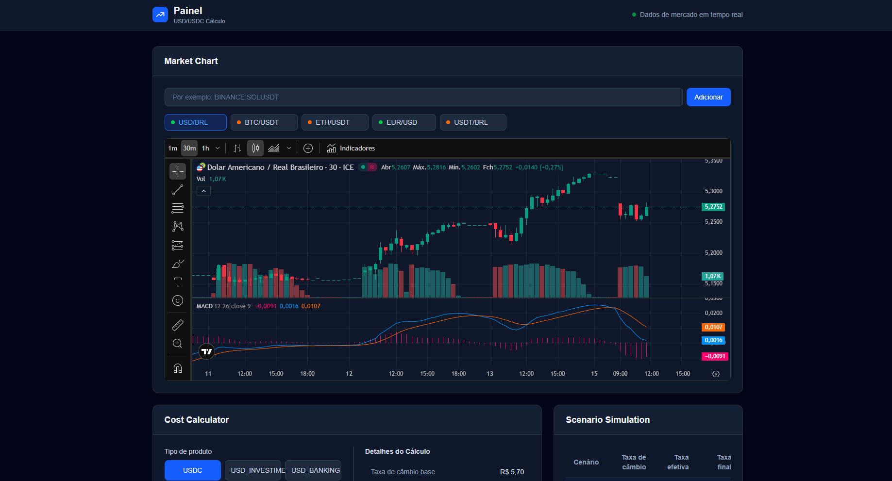
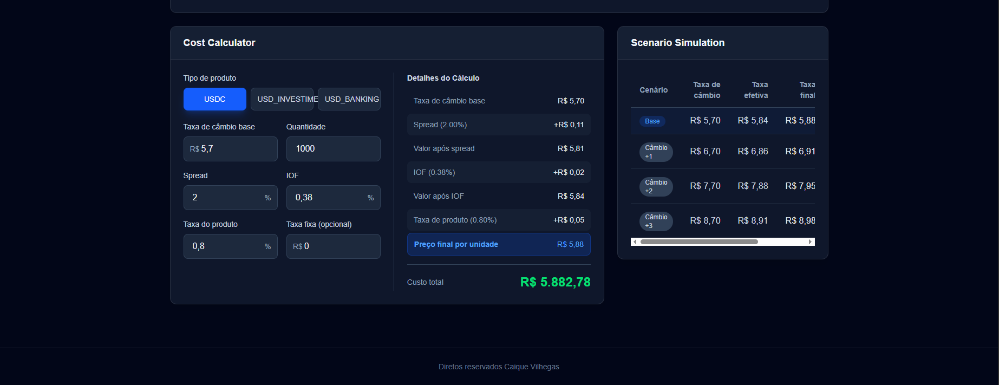

<!-- BANNER SUPERIOR -->
<div align="center">

# 💱 FX USD / USDC Simulator

Interactive simulator designed to calculate the real cost of converting BRL to USD or USDC, including spread, IOF and additional fees.

[](https://fx-usd-usdc-simulator-delta.vercel.app/)

</div>

---

## 📋 About the Project

This project is a financial simulator that calculates the real cost of purchasing USD or USDC based on exchange rate, spread, IOF, and additional platform fees.

The tool was developed to provide a clear visualization of how different variables affect the final exchange rate and total transaction cost.

The main goal of this project was to practice **financial calculations**, **dynamic state management**, and **interactive UI development** using modern frontend technologies.

---

## 🛠️ Technologies Used

<div align="center">


</div>

---

## ✨ Features

- Currency conversion simulation (BRL → USD / USDC)
- Dynamic calculation of spread
- IOF tax calculation
- Additional product fee configuration
- Detailed cost breakdown
- Interactive and responsive interface

---

## 📷 Preview

<div align="center">




</div>

---

## 🚀 Installation and Usage

### Prerequisites

- Node.js installed

### Step by step

```bash
# Clone the repository
git clone https://github.com/vilhegas/fx-usd-usdc-simulator.git

# Enter the project folder
cd fx-usd-usdc-simulator

# Install dependencies
npm install

# Run the project
npm run dev
